# Projet Network Science 2023-2024

Ceci est l'œuvre d'un projet réalisé lors de mon Erasmus à l'Università degli studi di Padova, dans le cadre du cours "Network Science".

L'objectif de ce projet est d'exploiter un jeu de données de notre choix afin de mettre en pratique les différentes notions apprises lors du cours.

## Table des matières

- [Préambule](#préambule)
    - [Technologies, dépendances et notations utilisées](#technologie-dépendances-et-notation-utilisées)
    - [Travail en amont](#travail-en-amont)
    - [Visualisation globale du jeu de données](#visualisation-globale-du-jeu-de-données)
- [Approche statistique](#approche-statistique)
    - [Étude des périodes](#étude-des-périodes)
    - [Étude des ventes](#étude-des-ventes)
- [Dispositions prises pour la suite de l'étude](#dispositions-prises-pour-la-suite-de-létude)

Le jeu de données utilisée est [Bakery sales.csv](data/Bakery%20sales.csv), car il est toujours bon de faire dans le cliché pour un français à l'étranger.

## Préambule
### Technologie, dépendances et notation utilisées
* Technologie : __Python__
* Dépendances : [requirements.txt](requirements.txt)
* Notation de mon code : de manière générale, la notation camelCase a été privilégiée
* Remarques sur la notation des variables dans les fonctions :
    - *iVariable* : entrée de la fonction
    - *oVariable* : sortie de la fonction
    - *ioVariable* : entrée et sortie de la fonction

### Travail en amont

Nettoyage du jeu de données : en effet, on y trouve une colonne "Unnamed: 0" ne nous servant pas, et on transforme les deux colonnes "unit_price" et "Quantity" en colonnes numériques, pour mieux les exploiter par la suite.

Création de plusieurs dataframes : il est utile par la suite de créer plusieurs dataframes différentes, issues de la principale : une pour l'ensemble des articles avec leurs prix unitaires, une pour l'ensemble des transactions avec le prix pour chaque, une dataframe par année d'activité

### Visualisation globale du jeu de données
Contenu du jeu de données :
- un tableau de 234005 lignes et 6 colonnes
- chaque ligne correspond à une vente d'un article avec sa quantité
- chaque ligne possède 6 attributs :
    - date : la date de la transaction
    - time : l'heure de la transaction
    - ticket number : le numéro de la transaction
    - article : l'article vendu
    - Quantity : la quantité d'articles vendus
    - unit_price : le prix unitaire de l'article vendu

*Remarque : un numéro de transaction peut apparaitre plusieurs fois avant de changer. En effet, un client peut acheter plusieurs articles lors d'une transaction, ce qui implique d'avoir une ligne différente par article achété, mais avec un même numéro de transaction.*

- le jeu de données s'étend du 01/01/2021 au 30/09/2022
- il y a 136451 transactions uniques dans le jeu de données
- il y a 149 articles différents dans le jeu de données

Le jeu de données sera d'abord traité statistiquement afin de récolter plusieurs informations, afin d'afiner, faciliter et simplifier le travail d'étude par la suite

## Approche statistique
Dans un premier temps, il a été décidé d'étudier le jeu de données sur les 2 périodes différentes de 2021 et 2022.
Cela permet de comparer certaines tendances.

### Étude des périodes
Pour chaque année, j'ai décidé de représenter les tendances des ventes :
- en fonction des heures de la journée
- en fonction des jours de la semaine
- en fonction des mois de l'année

Voici les différents résultats :
*histogrammes pour 2021 :*
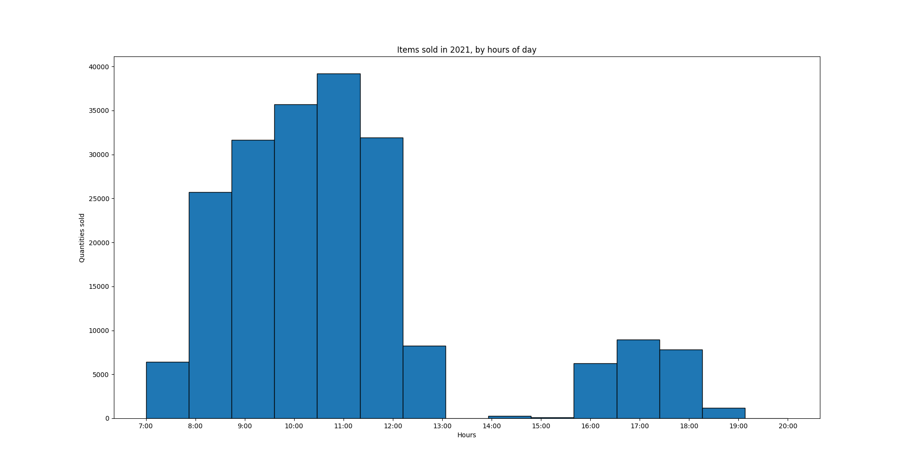
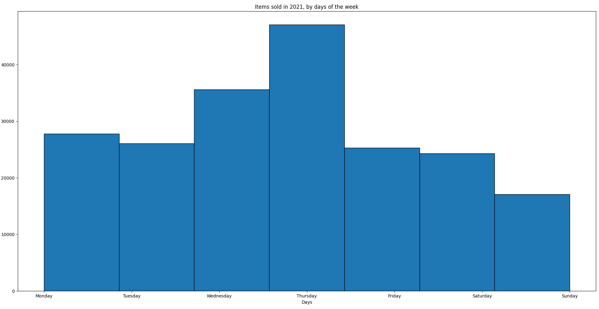
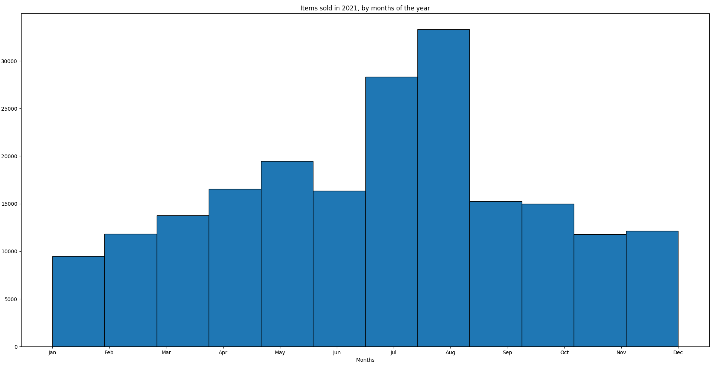

*histogrammes pour 2022 :*
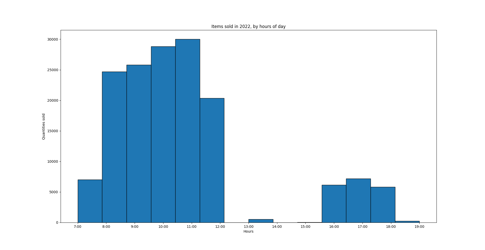
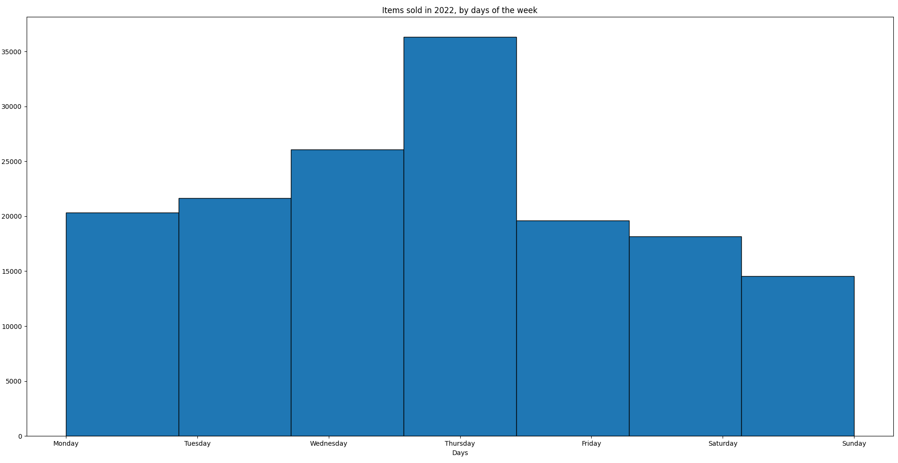

### Étude des ventes
Pour les nerds des stats, voici quelques valeurs qui pourront peut-être nous être utiles par la suite :
Sur l'ensemble des transactions, donc les deux périodes confondues :
- moyenne : 4.094076628240174
- médiane : 2.4
- écart-type : 4.536965317794293
Si l'on veut la même chose pour les deux périodes distinctes :
- pour 2021 :
    - moyenne : 4.0022126115704655
    - médiane : 2.4
    - écart-type : 4.492863304123514
- pour 2022 :
    - moyenne : 4.209820298784325
    - médiane : 2.6
    - écart-type : 4.589348537123853

Ensuite, j'ai décidé de représenter les ventes de différentes manières.
Tout d'abord, j'ai voulu observer les différents éléments en fonction de leur prix de vente pour comparer cela avec leur proportion dans les ventes

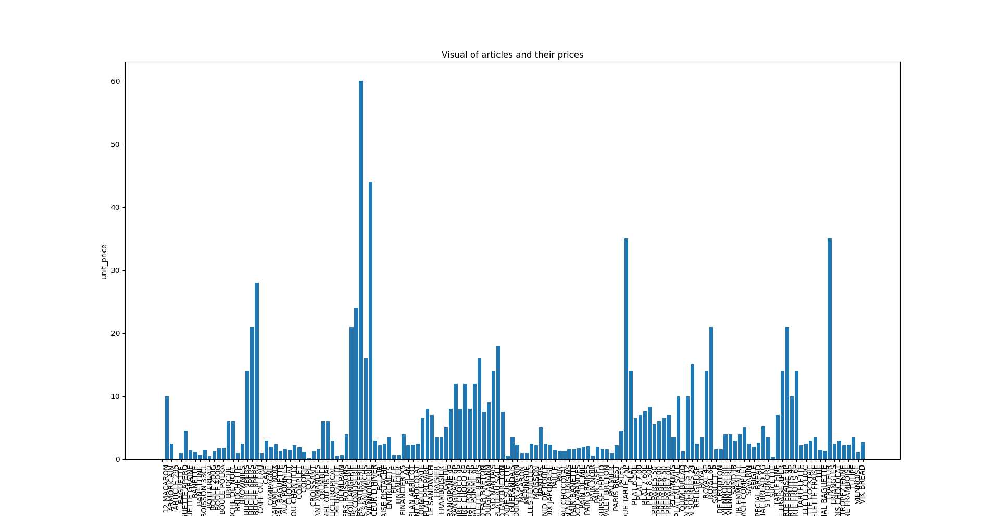
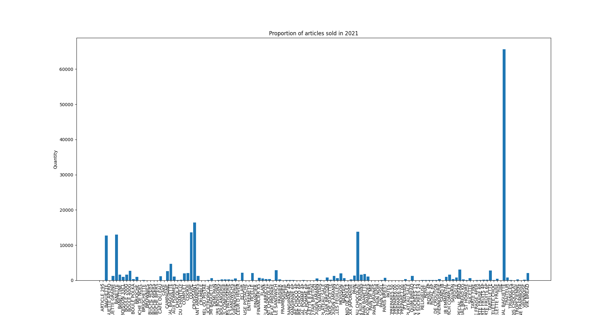
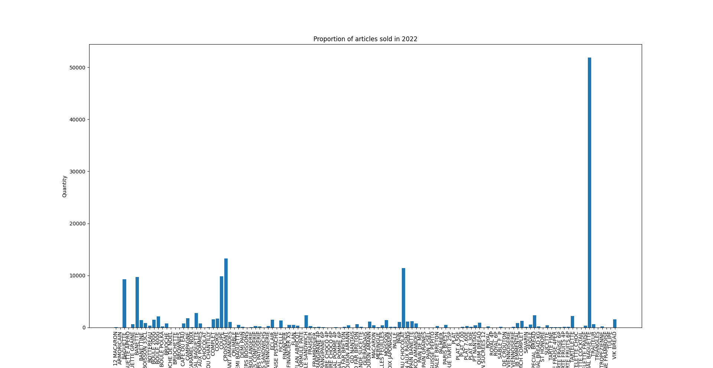

Si on souhaite visualiser cela pour chaque année, on peut observer les diagrammes circulaires, représentant les proportions de vente de chaque article par rapport au chiffre d'affaire annuel

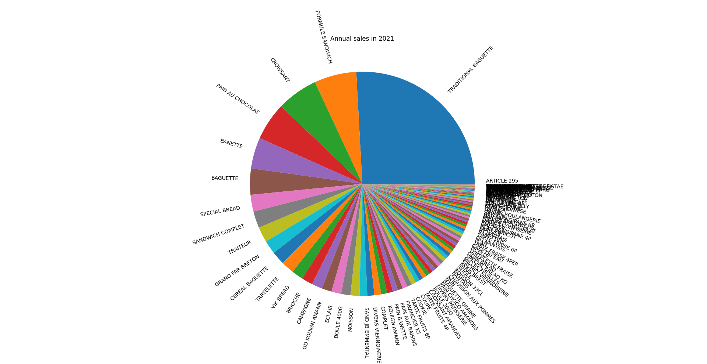
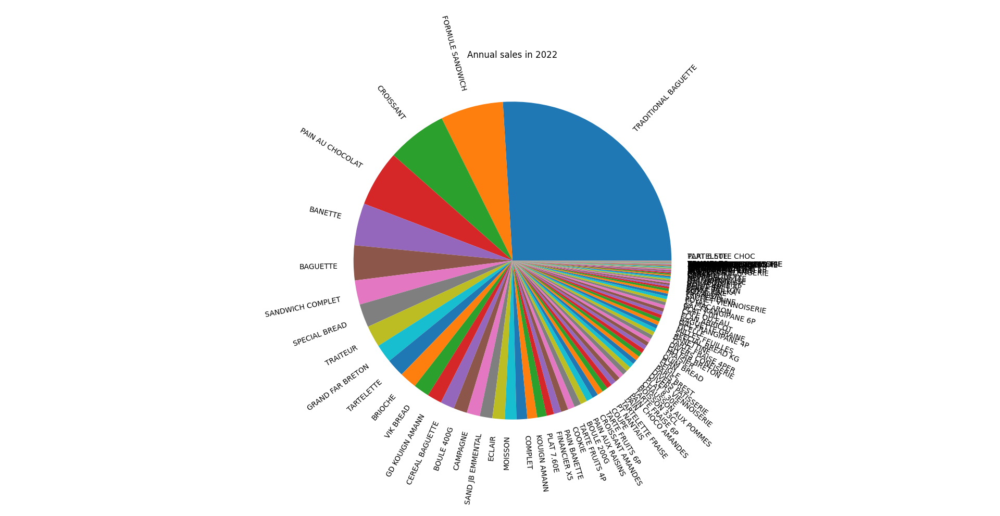

Cependant, si on observe ces deux diagrammes, on observe un grand nombre d'articles avec une proportion de ventes assez faibles et qui rendent la lecture du diagramme peu agréable. J'ai donc décidé de les regrouper en une catégorie nommée "Others" lors que la proportion de ventes de l'article est inférieure à un seuil. Voici ce que l'on obtient avec des seuils de 0.5%, 1% et 2%

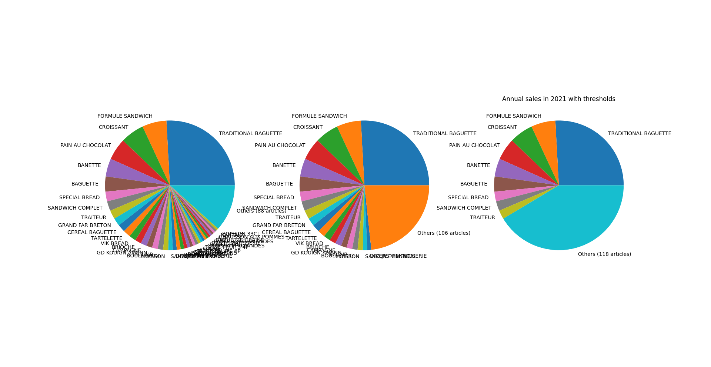
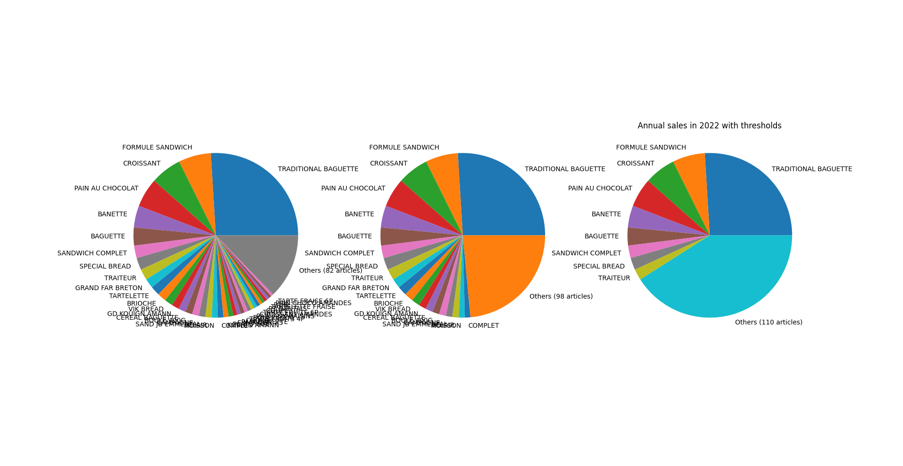

On remarque donc une présence assez importante d'articles regroupés ensemble. La question qui se pose à présent est la suivante : si nous devons choisir un seuil, quel doit être sa valeur afin de rester cohérent avec le reste de l'étude du jeu de données ?

## Dispositions prises pour la suite de l'étude

Pour la suite de l'étude, j'ai donc décidé de partir sur l'étude de l'ensemble de la période, et non la distinction de 2021 et 2022. Voici donc les différents diagrammes dont nous disposons :

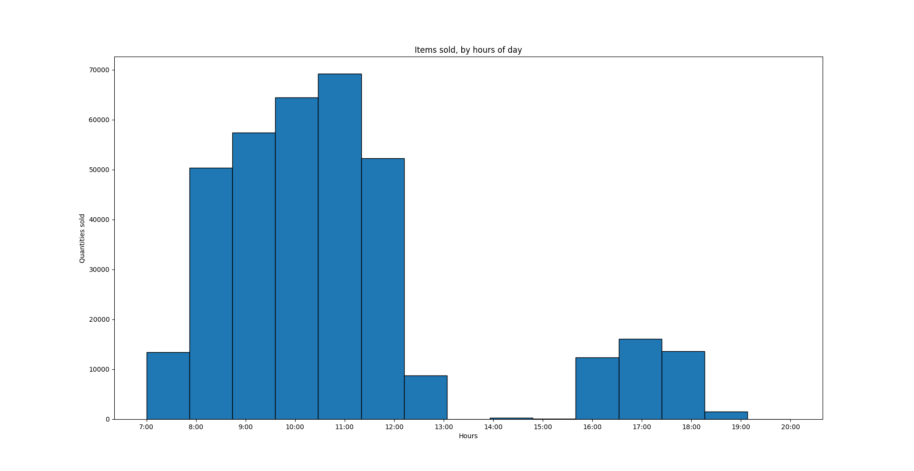
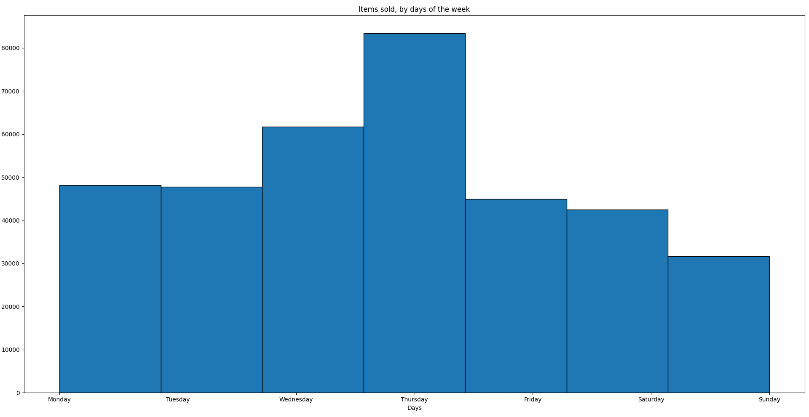
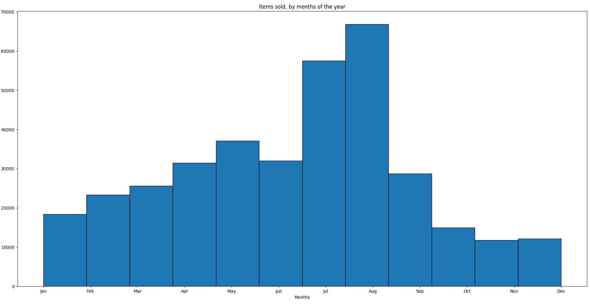

Pour les ventes des différentes articles, j'ai décidé de regrouper certains articles sous une même bannière.
Par exemple, tous les types de baguette seront regroupés sous le même nom "baguette", peu importe s'il s'agit d'une tradition, d'une banette etc ...

Un problème arrive vite cepandant : dans quelle mesure doit-on catégoriser les éléments, c'est-à-dire les regrouper sous une même bannière pour la suite du projet ?
Si on observe la figure ci-dessous, on observe des groupements différents, qui pourraient affecter la suite des résultats, voire les interprétations possibles, si on venait à trop simplifier notre problème.

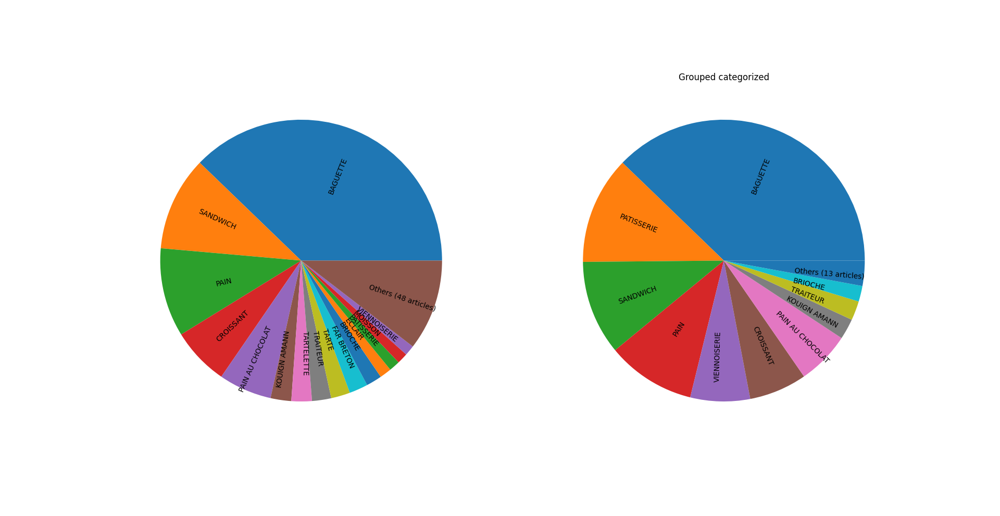

Après réflexion, et par soucis de curiosité et de rigueur, j'ai décidé de me concentrer sur le jeu de données avec un groupement normal et un seuil de regroupement de 1% afin de poursuivre cette trame. 

Cependant, nous verrons en fin de projet la comparaison avec un groupement plus large et un seuil différent de regroupement, pour voir si cela change ou non quelque chose dans les résultats que nous pouvons obtenir.

Voici donc les graphiques que nous pouvons retenir pour la suite

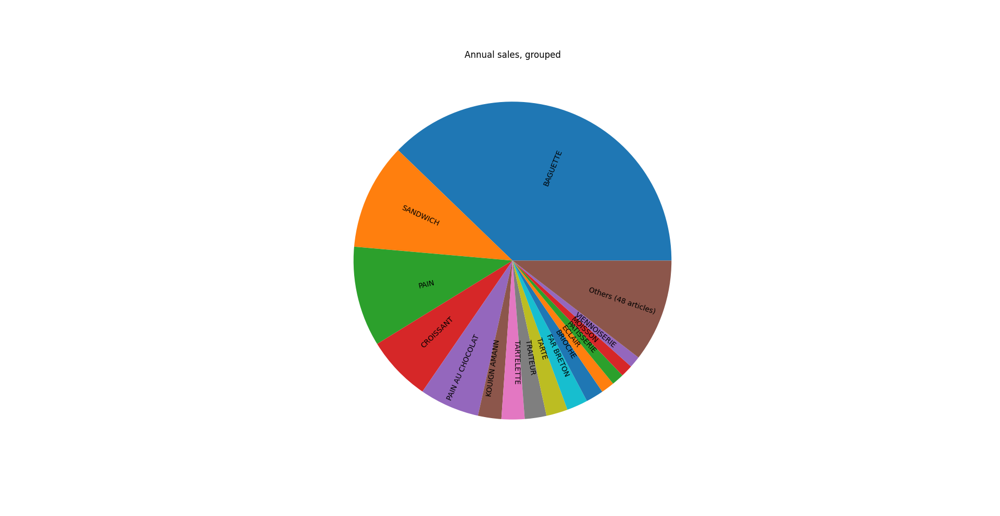
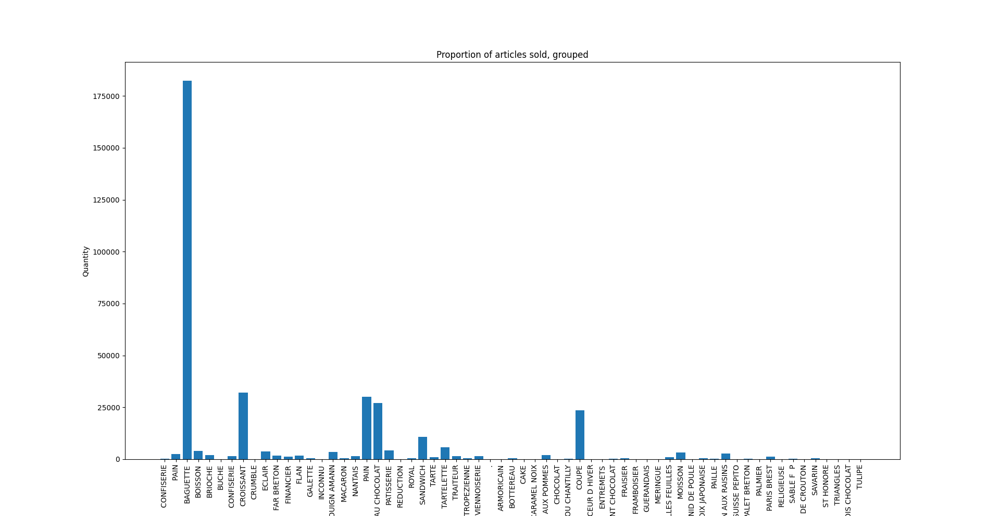

De plus, on garde à l'esprit les différentes valeurs suivantes :
- moyenne : 4.094076628240174
- médiane : 2.4
- écart-type : 4.536965317794293
