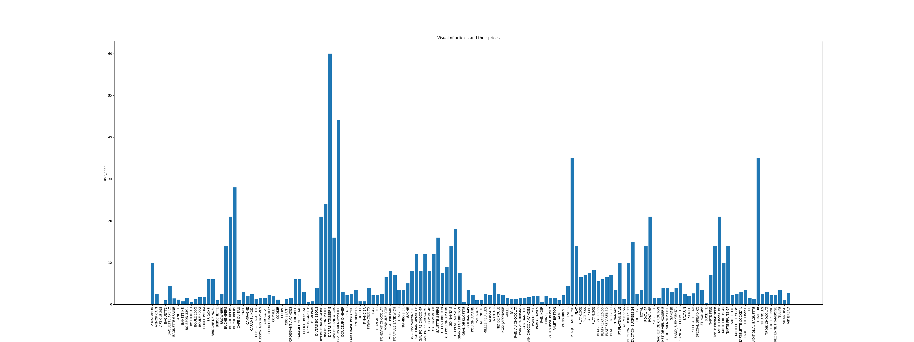

# Projet Network Science 2023-2024

Ceci est l'œuvre d'un projet réalisé lors de mon Erasmus à l'Università degli studi di Padova, dans le cadre du cours "Network Science".

L'objectif de ce projet est d'exploiter un jeu de données de notre choix afin de mettre en pratique les différentes notions apprises lors du cours.

## Table des matières

- [Préambule](#préambule)
    - [Travail en amont](#travail-en-amont)
    - [Visualisation globale du jeu de données](#visualisation-globale-du-jeu-de-données)
- [Approche statistique](#approche-statistique)
    - [Étude des périodes](#étude-des-périodes)
    - [Étude des ventes](#étude-des-ventes)
- [Suite de l'étude](#suite-de-létude)

- [Remerciements](#remerciements)
- [Annexes](#annexes)
    - [Organisation des fichiers](#organisation-des-fichiers)
    - [Technologies et notation](#technologies-et-notation)
        - [Technologies utilisées](#technologies-utilisées)
        - [Notation](#notation)


Le jeu de données utilisée est [Bakery sales.csv](data/Bakery%20sales.csv), car il est toujours bon de faire dans le cliché pour un français à l'étranger.

## Préambule
### Travail en amont

Nettoyage du jeu de données : en effet, on y trouve une colonne "Unnamed: 0" ne nous servant pas, et on transforme les deux colonnes "unit_price" et "Quantity" en colonnes numériques, pour mieux les exploiter par la suite.

Création de plusieurs dataframes : il est utile par la suite de créer plusieurs dataframes différentes, issues de la principale : une pour l'ensemble des articles avec leurs prix unitaires, une pour l'ensemble des transactions avec le prix pour chaque, une dataframe par année d'activité

### Visualisation globale du jeu de données
Contenu du jeu de données :
- un tableau de 234005 lignes et 6 colonnes
- chaque ligne correspond à une vente d'un article avec sa quantité
- chaque ligne possède 6 attributs :
    - date : la date de la transaction
    - time : l'heure de la transaction
    - ticket_number : le numéro de la transaction
    - article : l'article vendu
    - Quantity : la quantité d'articles vendus
    - unit_price : le prix unitaire de l'article vendu

*Remarque : un numéro de transaction peut apparaitre plusieurs fois avant de changer. En effet, un client peut acheter plusieurs articles lors d'une transaction, ce qui implique d'avoir une ligne différente par article achété, mais avec un même numéro de transaction.*

- le jeu de données s'étend du 01/01/2021 au 30/09/2022
- il y a 136451 transactions uniques dans le jeu de données
- il y a 149 articles différents dans le jeu de données

Voici un aperçu de ce que l'on peut afficher du contenu en le mettant sous une forme de dataframe :
```shell
             date   time  ticket_number               article  Quantity  unit_price  total
0      2021-01-02  08:38       150040.0              BAGUETTE       1.0        0.90   0.90
1      2021-01-02  08:38       150040.0      PAIN AU CHOCOLAT       3.0        1.20   3.60
2      2021-01-02  09:14       150041.0      PAIN AU CHOCOLAT       2.0        1.20   2.40
3      2021-01-02  09:14       150041.0                  PAIN       1.0        1.15   1.15
4      2021-01-02  09:25       150042.0  TRADITIONAL BAGUETTE       5.0        1.20   6.00
...           ...    ...            ...                   ...       ...         ...    ...
234000 2022-09-30  18:52       288911.0                 COUPE       1.0        0.15   0.15
234001 2022-09-30  18:52       288911.0            BOULE 200G       1.0        1.20   1.20
234002 2022-09-30  18:52       288911.0                 COUPE       2.0        0.15   0.30
234003 2022-09-30  18:55       288912.0  TRADITIONAL BAGUETTE       1.0        1.30   1.30
234004 2022-09-30  18:56       288913.0  TRADITIONAL BAGUETTE       1.0        1.30   1.30
```

Le jeu de données sera d'abord traité statistiquement afin de récolter plusieurs informations, afin d'afiner, faciliter et simplifier le travail d'étude par la suite.

## Approche statistique
Dans un premier temps, il a été décidé d'étudier le jeu de données sur les 2 périodes différentes de 2021 et 2022.
Cela permet de comparer certaines tendances.

### Étude des périodes
Pour chaque année, j'ai décidé de représenter les tendances des ventes :
- en fonction des heures de la journée
- en fonction des jours de la semaine
- en fonction des mois de l'année

Voici les différents résultats :
*histogrammes pour 2021 :*


*histogrammes pour 2022 :*


### Étude des ventes
Pour les nerds des stats, voici quelques valeurs qui pourront peut-être nous être utiles par la suite :
Sur l'ensemble des transactions, donc les deux périodes confondues :
- moyenne : 4.094076628240174
- médiane : 2.4
- écart-type : 4.536965317794293
Si l'on veut la même chose pour les deux périodes distinctes :
- pour 2021 :
    - moyenne : 4.0022126115704655
    - médiane : 2.4
    - écart-type : 4.492863304123514
- pour 2022 :
    - moyenne : 4.209820298784325
    - médiane : 2.6
    - écart-type : 4.589348537123853

Ensuite, j'ai décidé de représenter les ventes de différentes manières.
Tout d'abord, j'ai voulu observer les différents éléments en fonction de leur prix de vente pour comparer cela avec leur proportion dans les ventes




Si on souhaite visualiser cela pour chaque année, on peut observer les diagrammes circulaires, représentant les proportions de vente de chaque article par rapport au chiffre d'affaire annuel


Cependant, si on observe ces deux diagrammes, on observe un grand nombre d'articles avec une proportion de ventes assez faibles et qui rendent la lecture du diagramme peu agréable. J'ai donc décidé de les regrouper en une catégorie nommée "Others" lors que la proportion de ventes de l'article est inférieure à un seuil. Voici ce que l'on obtient avec des seuils de 0.5%, 1% et 2%


On remarque donc une présence assez importante d'articles regroupés ensemble. La question qui se pose à présent est la suivante : si nous devons choisir un seuil, quel doit être sa valeur afin de rester cohérent avec le reste de l'étude du jeu de données ?

## Première cartographie

En utilisant [Gephi](https://gephi.org/), on peut représenter notre jeu de données, en suivant une logique de graphe biparti :
- sous-ensemble 1 : les articles
- sous-ensemble 2 : les tickets

Pour représenter cela dans Gephi, on doit utiliser 3 fichiers :
- un fichier [articles-nodes.csv](data/global/articles-nodes.csv) comprenant un ID et un label pour chaque article
- un fichier [tickets-nodes.csv](data/global/tickets-nodes.csv), comprenant un ID (le label est plus délétère qu'autre chose)
- un fichier [edges-global.csv](data/global/edges-global.csv) comprenant une source, une target et un poids (le poids correspond à la quantité d'article vendu)

En utilisant ces fichiers, générés pour chaque groupement en catégorie, on se retrouve avec les cartographies suivantes :


*<p style="text-align: center;">Cartographie standard, aucune catégorie</p>*
\

*<p style="text-align: center;">Cartographie avec catégorisation "normale"</p>*
\

*<p style="text-align: center;">Cartographie avec catégorisation "large"</p>*
\
Les différentes cartes sont composées de plusieurs éléments :
- chaque petit point sans label correspond à une transaction
- chaque point avec une taille plus ou moins grande avec un label correspond à un article vendu
- chaque transaction est reliée à un ou plusieurs articles, via les courbes

Les labels, points et courbes sont colorées. En effet, Gephi met à disposition différents algorithmes afin d'améliorer les cartes générées. Ici, j'ai utilisé l'algorithme de PageRank pour générer les tailles des points pour les articles (ce qui génère aussi la taille des labels), et l'algorithme de modularité pour les couleurs.
Ce dernier permet de déterminer quels éléments sont plus susceptibles d'appartenir à la même catégorie.

Si on pouvait observer que les différents types de baguettes ne semblaient pas appartenir à la même catégorie avec la première cartographie, il aurait été insensé de ne pas les regrouper par la suite. De plus, on observe que cela ne semble pas avoir d'incidence sur les autres cartographies.

On remarque également que certains articles se regroupent par couleurs lors de la deuxième cartographie, ce qui tend à donner une catégorie plus globale et qui semble ressembler à celle que j'ai décidé arbitrairement pour la cartographie avec une catégorisation plus large.

Cependant, cela ne me permet pas de déterminer s'il est plus probable qu'un article soit acheté avec un autre. Pour cela, je vais devoir lancer un algorithme de PageRank en prenant comme référentiel l'article dont je souhaite connaitre les potentiels achats en même temps.

## Suite de l'étude

Comme il a été vu précédement, on se retrouve avec 2 problèmatiques :
- à quel point doit-on grouper les articles avec une faible proportion ?
- à quel point doit-on grouper les articles dans une même catégorie ?

Nous allons donc voir les différences selon ces problématiques, et voir si cela impacterait l'étude du jeu de données de manière générale.

## Étude du pagerank des articles

Dans notre étude de cas, il peut être intéressant de s'intéresser aux différents achats d'un client. De ce fait, il pourrait être judicieux de savoir ce qu'un client serait susceptible d'acheter d'autres lorsqu'il achète tel ou tel article.

Pour déterminer cela, on va utiliser le système de pagerank. Pour mon cas, j'ai procédé de la manière suivante : en se basant sur un article de référence dans le jeu de données, on se base uniquement sur les transactions contenant au moins cet article et on calcule la récurrence de présence des autres articles. En faisant cela, on obtient un résultat similaire à ceci :
```shell
                  article  presence  quantity
0                BAGUETTE      7948   11681.0
1        PAIN AU CHOCOLAT      1198    2937.0
2                    PAIN        99     140.0
3    TRADITIONAL BAGUETTE      2037    3138.0
4               CROISSANT      1472    3949.0
..                    ...       ...       ...
139          CARAMEL NOIX         2       2.0
140               MACARON        11      30.0
141            12 MACARON         3       3.0
144            SABLE F  P         9      14.0
146                TULIPE         1       2.0
```
*Résultat de pagerank pour l'article "BAGUETTE"*

La colonne "presence" représente le nombre de fois où l'article a été acheté avec l'article de référence, ici BAGUETTE. Pour la ligne "BAGUETTE", il s'agit du nombre de fois où l'article a été achété seul.
La colonne "quantity" représente la quantité achteté de manière globale avec l'article de référence.

En utilisant ces deux colonnes, on peut calculer une troisème valeur :
```shell
                  article  presence  quantity  average bought
0                BAGUETTE      7948   11681.0        1.469678
1        PAIN AU CHOCOLAT      1198    2937.0        2.451586
2                    PAIN        99     140.0        1.414141
3    TRADITIONAL BAGUETTE      2037    3138.0        1.540501
4               CROISSANT      1472    3949.0        2.682745
..                    ...       ...       ...             ...
139          CARAMEL NOIX         2       2.0        1.000000
140               MACARON        11      30.0        2.727273
141            12 MACARON         3       3.0        1.000000
144            SABLE F  P         9      14.0        1.555556
146                TULIPE         1       2.0        2.000000
```
*Résultat de pagerank pour l'article "BAGUETTE"*

Appelée "average bought", il s'agit du rapport entre la quantité et la récurrence de présence de chaque article. Cette valeur nous permet de savoir si un article est plutôt acheté ponctuellement avec l'article, avec une valeur tendant vers 1, ou bien en grosse quantité en même temps qu'acheté avec l'article, avec une valeur tendant vers l'infini.

Cependant, cela ne nous permet pas vraiment de déterminer réellement quel article est le plus susceptible d'être acheté avec notre article de référence. Pour cela, on décide de calculer deux autres colonnes :
- la première calcule le rapport entre la valeur "average bought" de l'article sur la somme de toutes les valeurs de cette colonn
- la deuxième calcule le rapport entre la valeur "presence" de l'article sur la somme de toutes les valeurs de cette colonne

En créant ces deux colonnes, on obtient le résultat suivant :
```shell
                  article  presence  quantity  average bought  weighted  not weighted
0                BAGUETTE      7948   11681.0        1.469678  0.363520      0.383128
1        PAIN AU CHOCOLAT      1198    2937.0        2.451586  0.091401      0.057749
2                    PAIN        99     140.0        1.414141  0.004357      0.004772
3    TRADITIONAL BAGUETTE      2037    3138.0        1.540501  0.097657      0.098192
4               CROISSANT      1472    3949.0        2.682745  0.122895      0.070957
..                    ...       ...       ...             ...       ...           ...
139          CARAMEL NOIX         2       2.0        1.000000  0.000062      0.000096
140               MACARON        11      30.0        2.727273  0.000934      0.000530
141            12 MACARON         3       3.0        1.000000  0.000093      0.000145
144            SABLE F  P         9      14.0        1.555556  0.000436      0.000434
146                TULIPE         1       2.0        2.000000  0.000062      0.000048
```
*Résultat de pagerank pour l'article "BAGUETTE"*

Grâce à ces deux dernières colonnes, et en triant selon les valeurs les plus hautes, on peut déterminer soit quel article revient le plus souvent, indépendamment de la quantité achetée, ou bien déterminer la même chose mais en prenant en compte la quantité.
```shell
                   article  presence  quantity  average bought  weighted  not weighted
0                 BAGUETTE      7948   11681.0        1.469678  0.363520      0.383128
4                CROISSANT      1472    3949.0        2.682745  0.122895      0.070957
3     TRADITIONAL BAGUETTE      2037    3138.0        1.540501  0.097657      0.098192
1         PAIN AU CHOCOLAT      1198    2937.0        2.451586  0.091401      0.057749
8                    COUPE      1538    1805.0        1.173602  0.056173      0.074138
..                     ...       ...       ...             ...       ...           ...
84   TROPEZIENNE FRAMBOISE         1       1.0        1.000000  0.000031      0.000048
82               TRIANGLES         1       1.0        1.000000  0.000031      0.000048
79  ECLAIR FRAISE PISTACHE         1       1.0        1.000000  0.000031      0.000048
57      GAL POIRE CHOCO 4P         1       1.0        1.000000  0.000031      0.000048
56      GAL POIRE CHOCO 6P         1       1.0        1.000000  0.000031      0.000048
```
*Résultat de pagerank pour l'article "BAGUETTE", trié selon la colonne "weighted"*
```shell
                    article  presence  quantity  average bought  weighted  not weighted
0                  BAGUETTE      7948   11681.0        1.469678  0.363520      0.383128
3      TRADITIONAL BAGUETTE      2037    3138.0        1.540501  0.097657      0.098192
8                     COUPE      1538    1805.0        1.173602  0.056173      0.074138
4                 CROISSANT      1472    3949.0        2.682745  0.122895      0.070957
1          PAIN AU CHOCOLAT      1198    2937.0        2.451586  0.091401      0.057749
..                      ...       ...       ...             ...       ...           ...
82                TRIANGLES         1       1.0        1.000000  0.000031      0.000048
79   ECLAIR FRAISE PISTACHE         1       1.0        1.000000  0.000031      0.000048
57       GAL POIRE CHOCO 4P         1       1.0        1.000000  0.000031      0.000048
53                 CHOCOLAT         1       2.0        2.000000  0.000062      0.000048
146                  TULIPE         1       2.0        2.000000  0.000062      0.000048
```
*Résultat de pagerank pour l'article "BAGUETTE", trié selon la colonne "not weighted"*

Pour notre exemple avec l'article BAGUETTE comme article de référence, on trouve :
- BAGUETTE est achetée seule la plupart du temps
- CROISSANT, TRADITIONAL BAGUETTE, PAIN AU CHOCOLAT et COUPE sont les articles qui viennent ensuite, mais dans un ordre différent selon la colonne de référence.

En reprenant les deux catégorisations que l'on avait créées précédement, on obtient les résultats suivants :

```shell
             article  presence  quantity  average bought  weighted  not weighted
0           BAGUETTE     63396  104683.0        1.651256  0.528510      0.516738
3          CROISSANT      8545   21505.0        2.516676  0.108572      0.069650
1   PAIN AU CHOCOLAT      6895   16481.0        2.390283  0.083207      0.056201
4               PAIN     11937   13436.0        1.125576  0.067834      0.097298
5              COUPE      9722   10908.0        1.121991  0.055071      0.079244
..               ...       ...       ...             ...       ...           ...
61            TULIPE         1       2.0        2.000000  0.000010      0.000008
54        GUERANDAIS         1       1.0        1.000000  0.000005      0.000008
45    TROIS CHOCOLAT         1       1.0        1.000000  0.000005      0.000008
40              CAKE         1       1.0        1.000000  0.000005      0.000008
34                 .         1       1.0        1.000000  0.000005      0.000008
```
*Résultat de pagerank pour l'article "BAGUETTE", catégorisation normale, trié selon la colonne "weighted"*

```shell
             article  presence  quantity  average bought  weighted  not weighted
0           BAGUETTE     63396  104683.0        1.651256  0.528510      0.516738
4               PAIN     11937   13436.0        1.125576  0.067834      0.097298
5              COUPE      9722   10908.0        1.121991  0.055071      0.079244
3          CROISSANT      8545   21505.0        2.516676  0.108572      0.069650
1   PAIN AU CHOCOLAT      6895   16481.0        2.390283  0.083207      0.056201
..               ...       ...       ...             ...       ...           ...
45    TROIS CHOCOLAT         1       1.0        1.000000  0.000005      0.000008
40              CAKE         1       1.0        1.000000  0.000005      0.000008
54        GUERANDAIS         1       1.0        1.000000  0.000005      0.000008
34                 .         1       1.0        1.000000  0.000005      0.000008
61            TULIPE         1       2.0        2.000000  0.000010      0.000008
```
*Résultat de pagerank pour l'article "BAGUETTE", catégorisation normale, trié selon la colonne "not weighted"*

```shell
              article  presence  quantity  average bought  weighted  not weighted
0            BAGUETTE     63396  104683.0        1.651256  0.535737      0.524888
3           CROISSANT      8545   21505.0        2.516676  0.110056      0.070748
1    PAIN AU CHOCOLAT      6895   16481.0        2.390283  0.084345      0.057087
4                PAIN     11937   13436.0        1.125576  0.068762      0.098833
5               COUPE      9722   10908.0        1.121991  0.055824      0.080493
11       VIENNOISERIE      6513   10425.0        1.600645  0.053352      0.053924
8          PATISSERIE      7658    9823.0        1.282711  0.050271      0.063405
7        KOUIGN AMANN      1343    2146.0        1.597915  0.010983      0.011119
6            SANDWICH      1215    1582.0        1.302058  0.008096      0.010060
10            BRIOCHE      1327    1400.0        1.055011  0.007165      0.010987
12         CONFISERIE       566     877.0        1.549470  0.004488      0.004686
9             BOISSON       483     614.0        1.271222  0.003142      0.003999
18           TRAITEUR       420     477.0        1.135714  0.002441      0.003477
13            NANTAIS       243     359.0        1.477366  0.001837      0.002012
2                PAIN       281     345.0        1.227758  0.001766      0.002327
16         CONFISERIE       102     171.0        1.676471  0.000875      0.000845
15  SACHET DE CROUTON        77      84.0        1.090909  0.000430      0.000638
21       CARAMEL NOIX        41      63.0        1.536585  0.000322      0.000339
14           CHOCOLAT         9      14.0        1.555556  0.000072      0.000075
20          REDUCTION         5       5.0        1.000000  0.000026      0.000041
17                  .         1       1.0        1.000000  0.000005      0.000008
19     TROIS CHOCOLAT         1       1.0        1.000000  0.000005      0.000008
```
*Résultat de pagerank pour l'article "BAGUETTE", catégorisation large, trié selon la colonne "weighted"*

```shell
              article  presence  quantity  average bought  weighted  not weighted
0            BAGUETTE     63396  104683.0        1.651256  0.535737      0.524888
4                PAIN     11937   13436.0        1.125576  0.068762      0.098833
5               COUPE      9722   10908.0        1.121991  0.055824      0.080493
3           CROISSANT      8545   21505.0        2.516676  0.110056      0.070748
8          PATISSERIE      7658    9823.0        1.282711  0.050271      0.063405
1    PAIN AU CHOCOLAT      6895   16481.0        2.390283  0.084345      0.057087
11       VIENNOISERIE      6513   10425.0        1.600645  0.053352      0.053924
7        KOUIGN AMANN      1343    2146.0        1.597915  0.010983      0.011119
10            BRIOCHE      1327    1400.0        1.055011  0.007165      0.010987
6            SANDWICH      1215    1582.0        1.302058  0.008096      0.010060
12         CONFISERIE       566     877.0        1.549470  0.004488      0.004686
9             BOISSON       483     614.0        1.271222  0.003142      0.003999
18           TRAITEUR       420     477.0        1.135714  0.002441      0.003477
2                PAIN       281     345.0        1.227758  0.001766      0.002327
13            NANTAIS       243     359.0        1.477366  0.001837      0.002012
16         CONFISERIE       102     171.0        1.676471  0.000875      0.000845
15  SACHET DE CROUTON        77      84.0        1.090909  0.000430      0.000638
21       CARAMEL NOIX        41      63.0        1.536585  0.000322      0.000339
14           CHOCOLAT         9      14.0        1.555556  0.000072      0.000075
20          REDUCTION         5       5.0        1.000000  0.000026      0.000041
17                  .         1       1.0        1.000000  0.000005      0.000008
19     TROIS CHOCOLAT         1       1.0        1.000000  0.000005      0.000008
```
*Résultat de pagerank pour l'article "BAGUETTE", catégorisation large, trié selon la colonne "not weighted"*

Pour notre exemple, on remarque que la catégorisation n'a pas l'air d'avoir d'impact sur la détermination des articles favoris en lien avec notre article de référence, mais il faudrait vérifier cela à tous les articles que l'on étudie.

Une nouvelle problématique apparait à l'issu du développement de cet outil pour notre étude de cas : si on arrive à déterminer les articles les plus achetés avec un article de référence, est-ce que la relation est bijective entre forcément ces articles à chaque fois ? De plus, dans quelle mesure faut-il se concentrer sur la relation entre les articles ? S'il semble logique d'observer les liens pour les articles ayant des parts importantes dans le chiffre d'affaire, à quel moment il n'est plus pertinent d'étudier les articles, et comment on choisit à quel seuil on n'a plus vraiment d'intérêt à regarder les liens ?

De plus, on peut déterminer une profondeur maximale en utilisant cet outils, afin de déterminer une potentielle "transaction maximale" selon l'article de référence.

## Objectif final

L'objectif final fictif de ce projet est de déterminer l'ensemble des articles qui permettent de maximiser le chiffre d'affaire de la boulangerie que l'on étudie.

On a vu dans un premier temps la proportion des ventes des articles par rapport au chiffre d'affaire.
<!--  -->
Pour plus de simplicité, on décide de faire un groupement normal, afin de ne pas perdre trop d'information.
<!--  -->

On peut voir grâce au diagramme ci dessus qu'il serait judicieux d'appliquer un seuil afin de regrouper les quelques articles avec un faible pourcentage.
<!--  -->

On constate alors qu'un seuil de 0.5% semble déjà suffisant pour la suite. On garde donc cette hypothèse.


On décide donc d'exploiter ce jeu de données modifier afin de déterminer les différents liens entre les articles. En observant les différentes parts dans le chiffre d'affaire des articles, on a le tableau suivant :
```shell
                 article  proportion of annual sales
1               BAGUETTE                   37.778754
21              SANDWICH                   10.825895
16                  PAIN                   10.183537
6              CROISSANT                    6.625992
17      PAIN AU CHOCOLAT                    6.098901
15  Others (37 articles)                    3.265502
12          KOUIGN AMANN                    2.371201
23            TARTELETTE                    2.344941
24              TRAITEUR                    2.207196
22                 TARTE                    2.181008
8             FAR BRETON                    2.138583
3                BRIOCHE                    1.799224
7                 ECLAIR                    1.352228
19            PATISSERIE                    1.245809
13               MOISSON                    1.237826
25          VIENNOISERIE                    1.169526
14               NANTAIS                    0.934321
11               GALETTE                    0.927250
2                BOISSON                    0.920627
9              FINANCIER                    0.741532
18      PAIN AUX RAISINS                    0.712408
10                  FLAN                    0.704925
5                  COUPE                    0.631130
20                 ROYAL                    0.567807
0                   PAIN                    0.527754
4    CHAUSSON AUX POMMES                    0.506121
```
*Liste des articles et leur part dans le chiffre d'affaire, trié de manière décroissante selon la part*

En appliquant le pagerank à chaque article, on obtient le résultat présent dans [result 1](./result%201.md).

On observe un grand nombre de correspondance, mais il est plus judicieux d'observer dans un premier temps uniquement les liens avec la colonnes "weighted".

# TODO : rajouter une colonne à pagerank pour indiquer de quel article on se réfère pour la suite, pour pouvoir le placer dans Gephi ou tout autre logiciel de graphe

## Pour aller plus loin
Voir la différence entre sans groupement, groupement normal et large sur l'étude de l'objectif final
Voir la différence selon les différents seuils (0%, 0.5%, 1%, 2%) pour chaque groupement
Voir tous les liens de tous les articles
___

## Remerciements

[Tomaso Erseghe](mailto:tomaso.erseghe@unipd.it) pour ses enseignements et ses éclaircissements sur mon étude de cas.

[Lejla Dzanko](mailto:lejladzanko94@gmail.com) pour ses TD et les échanges sur mes différents problèmes de cartographies.

Luca Hammer pour [son article](https://medium.com/@Luca/guide-analyzing-twitter-networks-with-gephi-0-9-1-2e0220d9097d).

Florent Lefebvre [(@Flefgraph)](https://twitter.com/FlefGraph) pour :
- [son Thread Twitter](https://twitter.com/FlefGraph/status/1429809288827088901)
- [son tutoriel Youtube](https://www.youtube.com/watch?v=cPIIJ9-LrKo)

[Quantmetry](https://www.quantmetry.com/) et ses 3 articles de blog sur le sujet de la théorie des réseaux :
- [Introduction à une théorie aux applications multiformes](https://www.quantmetry.com/blog/tout-est-graphe-introduction-a-une-theorie-aux-applications-multiformes/)
- [Détection de communautés : théorie et retour d’expérience](https://www.quantmetry.com/blog/tout-est-graphe-detection-de-communautes-theorie-et-retour-dexperience/)
- [Comment identifier les rôles stratégiques des influenceurs d'un réseau ?](https://www.quantmetry.com/blog/tout-est-graphe-comment-identifier-les-roles-strategiques-des-influenceurs-dun-reseau/)

## Annexes
### Organisation des fichiers

```shell
.
├── PDF Exemples
├── data                    : contient les données utilisées
│   ├── global              : contient les fichiers nodes et edges pour le cas général
│   ├── large group         : contient les fichiers nodes et edges en groupant large
│   ├── normal group        : contient les fichiers nodes et edges pour le cas général
├── functions               : contient l'ensemble des fichiers .py
├── gephi files             : contient l'ensemble des fichiers pour les cartographies sur Gephi
├── images                  : contient les images d'illustration
│   ├── categories          : contient les images selon les catégories
│   │   ├── large
│   │   └── normal
│   ├── maps                : contient les cartographies générées via Gephi
```

### Technologies et notation
#### Technologies utilisées
Ordinateur : Macbook Air 2021, puce M1, 8Go de RAM 
Éditeur de code : Visual Studio Code
Language de programmation : Python
Liste des dépendances : [requirements.txt](requirements.txt) (pas encore créé)
#### Notation
Notation de mon code : de manière générale, la notation camelCase a été privilégiée
Remarques sur la notation des variables dans les fonctions :
    - *iVariable* : entrée de la fonction
    - *oVariable* : sortie de la fonction
    - *ioVariable* : entrée et sortie de la fonction
    - *isVariable* : définit un booléen